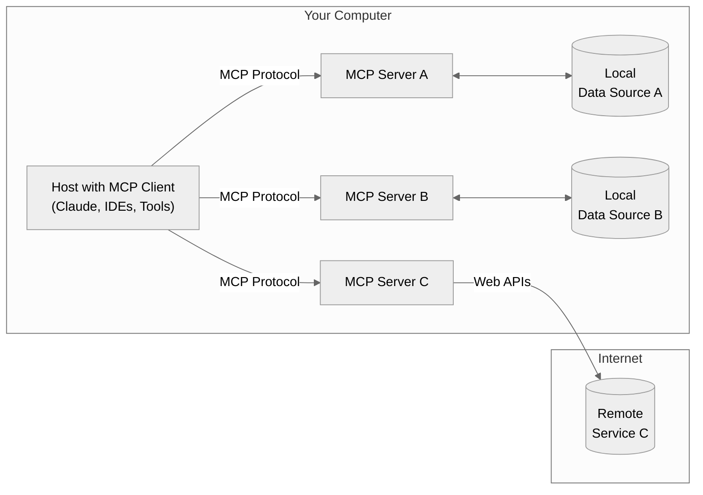
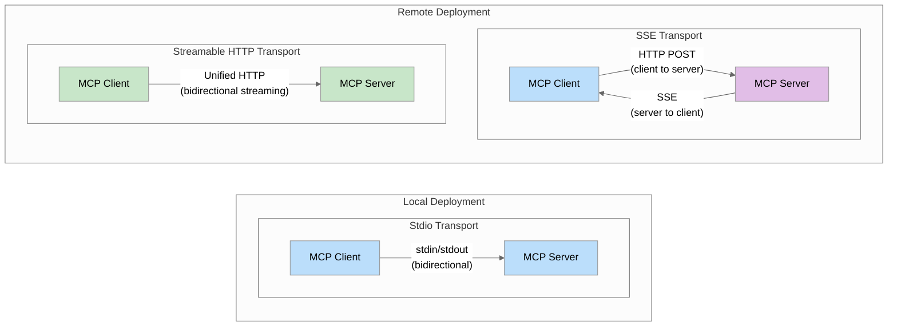

# Model Context Protocol (MCP)

**MCP** (Model Context Protocol) is an open standard designed to facilitate seamless integration between large language models (LLMs) and external tools, services, and data sources. By standardizing the interface, MCP enables AI systems to access and interact with external resources in a consistent and secure manner.

### How MCP Works

MCP operates on a client-server architecture, utilizing JSON-RPC 2.0 for communication. This setup allows AI applications (clients) to connect with various MCP servers that provide access to specific tools, resources, or data.

**Core Components:**
- **MCP Host**: The AI application that orchestrates and oversees multiple MCP clients
- **MCP Client**: A dedicated component within the host that establishes connections with MCP servers
- **MCP Server**: A service that delivers context, tools, and resources to MCP clients

## Protocol Layers

### 1. Data Layer (Inner)
JSON-RPC 2.0 protocol defining message structure and semantics:
- **Lifecycle management**: Handles connection initialization, capability negotiation, and connection termination between clients and servers
- **Server features**: Enables servers to provide core functionality including tools for AI actions, resources for context data, and prompts for interaction templates from and to the client
- **Client features**: Enables servers to ask the client to sample from the host LLM, elicit input from the user, and log messages to the client
- **Utility features**: Supports additional capabilities like notifications for real-time updates and progress tracking for long-running operations

### 2. Transport Layer (Outer)
The transport layer manages communication channels and authentication between clients and servers. It handles connection establishment, message framing, and secure communication between MCP participants.
MCP supports three main transport mechanisms:

1. **Stdio (Standard IO)**: 
   - Communication occurs over standard input/output streams
   - Best for local integrations when the server and client are on the same machine
   - Simple setup with no network configuration required

2. **SSE (Server-Sent Events)**:
   - Uses HTTP for client-to-server communication and SSE for server-to-client
   - Suitable for remote connections across networks
   - Allows for distributed architectures

3. **Streamable HTTP** *(Introduced March 24, 2025)*:
   - Modern HTTP-based streaming transport that supersedes SSE
   - Uses a unified endpoint for bidirectional communication
   - **Recommended for production deployments** due to better performance and scalability
   - Supports both stateful and stateless operation modes

The transport layer abstracts communication details from the protocol layer, enabling the same JSON-RPC 2.0 message format across all transport mechanisms.

#### Transport Mechanism Comparison

Note: Remote Procedure Call(RPC)
MCP is a stateful protocol that requires lifecycle management. The purpose of lifecycle management is to negotiate the capabilities that both client and server support

## Core Primitives
MCP primitives are the most important concept within MCP. They define what clients and servers can offer each other. These primitives specify the types of contextual information that can be shared with AI applications and the range of actions that can be performed.

MCP servers expose three types of primitives:
| Primitive | Purpose | Examples |
|-----------|---------|----------|
| **Tools** | Executable functions | File operations, API calls, DB queries |
| **Resources** | Data sources | File contents, DB records, API responses |
| **Prompts** | Interaction templates | System prompts, few-shot examples |

 primitive type has associated methods for discovery (*/list), retrieval (*/get), and in some cases, execution (tools/call). MCP clients will use the */list methods to discover available primitives. For example, a client can first list all available tools (tools/list) and then execute them. This design allows listings to be dynamic.

### Discovery Pattern
- `*/list` - Discover available primitives
- `*/get` - Retrieve specific primitives  
- `tools/call` - Execute tools

## Key Benefits
- **Standardized interface** for LLM-tool integration
- **Secure communication** with authentication
- **Dynamic discovery** of capabilities
- **Flexible transport** options (local/remote)

